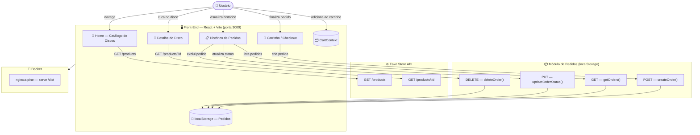

# 🎵 Sulco Cósmico — Loja de Vinil

> **"Descubra o disco pelo sulco"**

Uma experiência de compra de discos de vinil com identidade visual artística e cósmica, construída com React + Vite. Consome dados de produtos da [Fake Store API](https://fakestoreapi.com) e os transforma em um catálogo de vinil com nomes de artistas, álbuns, gêneros musicais e raridade.

---

## 🌐 Arquitetura da Aplicação



---

## ✨ Funcionalidades

| Feature | Descrição |
|---|---|
| 📀 Catálogo de Discos | Listagem com cards artísticos, covers, gênero, raridade e rating |
| 🔍 Filtros | Por gênero musical, raridade, busca textual e ordenação (preço/rating) |
| 📄 Paginação | 8 discos por página |
| 🎵 Detalhe do Disco | Preview de "colocar na vitrola" com animação de disco girando |
| 🛒 Carrinho | Drawer lateral animado, controle de quantidade, total |
| ✅ Checkout | Formulário de entrega com simulação de pedido (POST) |
| 📋 Histórico | Lista de pedidos com status, progress bar e expansão |
| 🔄 Atualizar Status | PUT — muda status do pedido (Pendente → Processando → Enviado → Entregue) |
| 🗑️ Excluir Pedido | DELETE — remove pedido do histórico |
| 💀 Skeleton Loading | Cards placeholder durante carregamento |
| 🎨 Animações | Framer Motion em todos os elementos interativos |
| 🔔 Toasts | Feedback visual ao adicionar ao carrinho / confirmar pedido |

---

## 🎸 Mapeamento Temático (Fake Store → Vinil)

| Fake Store | Sulco Cósmico |
|---|---|
| `title` | Nome do álbum |
| `category` | Gênero musical |
| `image` | Capa do disco |
| `price` | Preço em R$ (× 5.2) |
| `rating.rate` | Raridade (Prensagem Limitada, 1ª Edição, etc.) |

---

## 🗂️ Estrutura do Projeto

```
sulco-cosmico/
├── public/
│   └── vinyl-icon.svg
├── src/
│   ├── components/
│   │   ├── CartDrawer.jsx     # Drawer lateral do carrinho
│   │   ├── DiscCard.jsx       # Card de disco com hover e animações
│   │   ├── Navbar.jsx         # Barra de navegação
│   │   ├── SkeletonCard.jsx   # Placeholder de loading
│   │   └── VinylDisc.jsx      # Componente de disco animado
│   ├── context/
│   │   └── CartContext.jsx    # Estado global do carrinho
│   ├── pages/
│   │   ├── Home.jsx           # Catálogo (GET produtos)
│   │   ├── DiscDetail.jsx     # Detalhe do disco (GET produto)
│   │   ├── Cart.jsx           # Checkout (POST pedido)
│   │   └── OrderHistory.jsx   # Histórico (GET/PUT/DELETE pedido)
│   ├── services/
│   │   ├── storeApi.js        # Chamadas à Fake Store API
│   │   └── ordersService.js   # CRUD de pedidos (localStorage)
│   ├── utils/
│   │   └── transform.js       # Transformação de dados → tema vinil
│   ├── App.jsx
│   ├── main.jsx
│   └── index.css
├── Dockerfile
├── docker-compose.yml
├── nginx.conf
├── vite.config.js
├── tailwind.config.js
└── package.json
```

---

## 🚀 Como Rodar Localmente

### Pré-requisitos

- [Node.js](https://nodejs.org) >= 22
- npm >= 10

### Instalação

```bash
# Clone o repositório
git clone https://github.com/salleslucas/front-end-sulcos-cosmicos.git
cd front-end-sulcos-cosmicos

# Instale as dependências
npm install

# Inicie o servidor de desenvolvimento
npm run dev
```

Acesse em: **http://localhost:5173**

### Build de produção

```bash
npm run build
npm run preview
```

---

## 🐳 Como Rodar com Docker

### Usando docker-compose (recomendado)

```bash
# Build e inicia o container
docker-compose up --build

# Em segundo plano
docker-compose up --build -d
```

Acesse em: **http://localhost:3000**

### Parar os containers

```bash
docker-compose down
```

### Usando Docker diretamente

```bash
# Build da imagem
docker build -t sulco-cosmico .

# Rodar o container
docker run -p 3000:80 sulco-cosmico
```

---

## 🌐 Rotas HTTP Implementadas

| Método | Origem | Uso |
|---|---|---|
| `GET` | Fake Store API | Listar todos os discos do catálogo |
| `GET` | Fake Store API | Buscar detalhe de um disco por ID |
| `POST` | localStorage (módulo interno) | Criar novo pedido no checkout |
| `PUT` | localStorage (módulo interno) | Atualizar status do pedido |
| `DELETE` | localStorage (módulo interno) | Excluir pedido do histórico |

---

## 🛠️ Tecnologias Utilizadas

| Tecnologia | Versão | Uso |
|---|---|---|
| React | 18.3 | Framework de UI |
| Vite | 5.x | Bundler e dev server |
| Tailwind CSS | 3.4 | Estilização utilitária |
| Framer Motion | 11.x | Animações |
| React Router DOM | 6.x | Roteamento SPA |
| react-hot-toast | 2.x | Notificações |
| Nginx | 1.27 | Servidor web (Docker) |
| Docker | — | Containerização |

---

## 👨‍💻 Autor

**Lucas Salles** — PUC-Rio Pós-Graduação, Sprint 2

---

*Sulco Cósmico — onde cada disco conta uma história do universo* 🌌
